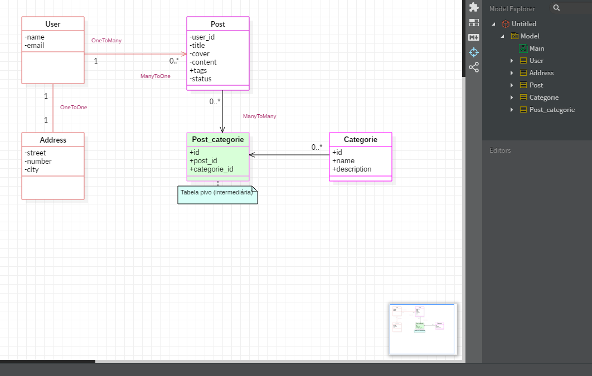

# Projeto LaraFox

## Descrição

Mini projeto desenvolvido com laravel 8 para demostrar a criação de CRUD basico em um sistema de blog. O projeto tem 
como proposito mostrar o sistema e também poder **aprender juntos** com todos as melhores formas de desenvolvimento. 
Os vídeos do projeto estarão disponíveis no canal Universo Code
- [Video canal YouTube](https://www.youtube.com/channel/UCMvtn8HZ12Ud-sdkY5KzTog).

## Melhorias e comentários
A idéia é no decorrer do desenvolvimento proposto, podermos propor melhorias, alguma forma mais adequada ou correção no desenvolvimento. 
 <code>Junte-se e apoie o canal! Comente os vídeos no canal do YouTube e instagram.</code>

 #### **Requisitos Funcionais (RF)**
 ##### Os requisitos funcionais referem-se sobre o que o sistema deve fazer, ou seja, suas funções e informações.
- [RF001] O Sistema deve cadastrar médicos profissionais (entrada)
- [RF002] O Sistema deve emitir um relatório de clientes (saída)
- [RF003] O Sistema deve passar um cliente da situação "em consulta" para "consultado" quando o cliente terminar de ser atendido (mudança de estado)
- [RF004] O cliente pode consultar seus dados no sistema

 #### **Requisitos Não-Funcionais (RNF)**
###### requisitos não funcionais definem propriedades e restrições do sistema como tempo, espaço, linguagens de programação, versões do compilador, SGBD, Sistema Operacional, método de desenvolvimento, etc.
- [RNF001] O sistema deve imprimir o relatório em até 5 segundos.
- [RNF002] Todos os relatórios devem seguir o padrão de relatórios especificado pelo setor XYZ.
- [RNF003] O sistema deve ser implementado em Java.

 #### **Diagrama de classes**
##### O diagramas de arquitetura de software oferecem a toda a equipe de desenvolvimento um panorama visual, facilitando a comunicação de ideias e conceitos-chave em termos que todos entendem.

 

<h5>Contatos </h5>

***[rafaelblum_digital@hotmail.com]***

[)](https://www.youtube.com/channel/UCMvtn8HZ12Ud-sdkY5KzTog)

